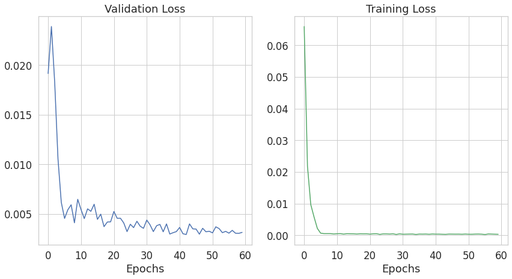
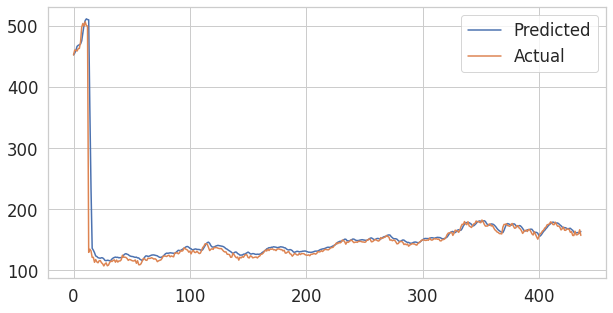

# Stock-Prices-Prediction-using-LSTM
POC of RNN, predict AAPL closing prices using LSTM

## Table of Contents

* [Motivation](#motivation)
* [About the Data](#about-the-data)
* [Results](#results)
* [Acknowledgements](#acknowledgements)

## Motivation

Consolidate knowledge of sequence models.

## About the Data

The data was collected using tiingo api.
tiingo is a tracing platform that provides a data api with historical end-of-day prices on equities, mutual funds and ETFs.
Free registeration is requierd to get an api key.

For more info, refer to here: [pandas_datareader](https://pandas-datareader.readthedocs.io/en/latest/remote_data.html?highlight=remote%20data%20access)

## Results

## Acknowledgements

This article was a great help in Data Preparation and Model Implementation, Also a great explanation of LSTM input requirements.
[MachineLearningMastery - Time Series Prediction using Keras](https://machinelearningmastery.com/time-series-prediction-with-deep-learning-in-python-with-keras/)
